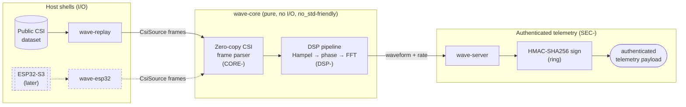

# High-Level Design: wave-parse

## Problem

WiFi Channel State Information (CSI) sensing — inferring presence, motion, and vital signs from how a human body perturbs WiFi subcarrier amplitude and phase — is a real and compelling capability. The most viral open-source instance, [RuView](https://github.com/ruvnet/RuView), demonstrated the *idea* but is structurally broken: a public [Quality Engineering audit](https://gist.github.com/proffesor-for-testing/02321e3f272720aa94484fffec6ab19b) documents **324 `unsafe` blocks with no safety documentation**, a **maintainable index of 48/100**, an **unauthenticated OTA firmware endpoint** (arbitrary code execution on edge devices), a **fake HMAC implementation** in the secure-TDM module providing zero cryptographic protection, and **no message authentication** on the CSI/beacon wire formats. Its sensing claims are also unverified — developers report negative results on real hardware ([issue #79](https://github.com/ruvnet/RuView/issues/79)).

The common failure mode is conflation: I/O, signal processing, and cryptography are tangled into one monolith, so none of them can be audited, fuzzed, or reused in isolation. The DSP correctness — the part that actually determines whether the system senses anything — is the least verified.

`wave-parse` exists to do the CSI sensing node *correctly*: a clean, isolatable, auditable CSI parsing + DSP core with an authenticated telemetry path, whose signal-processing output is validated against real published data with ground truth.

## Approach

A **library-core + thin host shells** architecture (see Key Design Decisions for why over the alternatives).

### Core mechanism — a pure, I/O-free signal core (`wave-core`)

All parsing and signal logic lives in one library crate with no sockets, no files, no crypto keys, and no allocations in the steady-state hot path:

- **Zero-copy CSI frame parsing** — raw byte payloads (the documented ESP32-S3 ESP-IDF CSI struct layout) are parsed into typed views over the original buffer, with every `unsafe` block carrying a `// SAFETY:` justification and exercised by a fuzzer.
- **DSP pipeline** — per-subcarrier streams pass through Hampel outlier rejection → phase sanitization (unwrapping / linear-fit detrending in the spirit of SpotFi phase correction) → FFT band extraction in the respiration band (~0.1–0.5 Hz) to recover a breathing waveform and rate estimate.
- `no_std`-friendly so the same core compiles toward the edge.

### Secondary discipline — swappable I/O hosts

A `CsiSource` trait abstracts where frames come from. The signal core never knows. A `wave-replay` host feeds public CSI datasets through it today; a `wave-esp32` host will feed a live serial/UDP stream later. The DSP is validated against real dataset ground truth *before* hardware variance is introduced.

### Secondary discipline — authenticated telemetry

Telemetry payloads leaving the node are authenticated with **`ring`-backed HMAC-SHA256** — directly replacing RuView's fake HMAC — and the transport (`wave-server`) authenticates connections rather than exposing open endpoints.

## Target Users

- **The maintainer/author**, demonstrating end-to-end competence across systems Rust, applied DSP, and cryptographic hygiene on a runnable, defensible artifact.
- **A developer who wants a correct, embeddable CSI processing core** they can run on public captures or their own ESP32 without adopting a monolith — needing the signal logic decoupled from I/O and crypto, at low integration cost.

## Goals

Specific and falsifiable:

1. **DSP correctness.** ✅ **Met.** The pipeline extracts a respiration waveform whose breathing-rate estimate matches ground truth within ±2 breaths/min. Validated on the open WiFi-CSI-MiningTool dataset (real Linux 802.11n CSI Tool data, subject S10, labels 9/12/15/18/21 bpm at Fs≈25 Hz): recovered 9.03 / 12.02 / 15.02 / 17.96 / 20.98 bpm — every error **< 0.05 bpm**. See `DSP-VAL-001` and References.
2. **Zero-copy hot path.** Steady-state frame processing in `wave-core` performs zero heap allocations, verified by an allocation-counting test/benchmark.
3. **Audited unsafe.** 100% of `unsafe` blocks in `wave-core` carry a `// SAFETY:` comment; enforced mechanically (clippy `unsafe_op_in_unsafe_fn` + a CI check).
4. **Fuzzed parser.** The CSI frame parser is fuzzed (`cargo-fuzz`) and survives the corpus with no panics or UB.
5. **Authenticated telemetry.** Telemetry payloads are HMAC-SHA256 verified with `ring`; forged or tampered payloads are rejected (test-proven).
6. **Source-swappable.** The same `wave-core` processes a dataset file and (later) a live stream through one `CsiSource` trait, with no signal-logic changes.
7. **Benchmarked.** The DSP loop has a Criterion benchmark establishing per-frame latency and guarding regressions.

## Non-Goals

- **No machine learning / pose estimation / "skeletons through walls."** No model training or inference. Output is a signal-processing waveform + rate estimate, not a neural perception system.
- **Not RuView-compatible.** No conformance to RuView's wire formats, module boundaries, or APIs. Standalone by design.
- **No multistatic mesh fusion.** Single-receiver processing; fusing multiple nodes is a possible v2, explicitly out of scope now (public datasets are typically single-receiver, so a fusion stage would have no real data to validate against).
- **Not a medical device.** Respiration extraction is validated against dataset ground truth only; no clinical claims.
- **No ESP32 firmware.** We consume the CSI output of stock/standard CSI firmware; writing firmware is out of scope.
- **No OTA update path.** The audited RuView OTA flaw is excluded by simply not having that surface.

## System Design

The boundary that matters: **everything inside `wave-core` is I/O-free, allocation-free in the hot path, and independently fuzzable/benchmarkable.** Hosts (`HOST-`) own all I/O and source selection; the security layer (`SEC-`) owns crypto and lives host-side, never in the core.

### Arrow segments

| Prefix | Segment | LLD (Phase 2) |
|---|---|---|
| `CORE-` | CSI frame types, zero-copy parser, ring/arena buffers | `docs/llds/core.md` |
| `DSP-` | Hampel filter, phase sanitization, FFT respiration extraction | `docs/llds/dsp.md` |
| `HOST-` | `CsiSource` trait, dataset replayer, ESP32 host | `docs/llds/hosts.md` |
| `SEC-` | HMAC-SHA256 telemetry auth, transport authentication | `docs/llds/security.md` |

## Key Design Decisions

| # | Decision | Alternatives considered | Rationale |
|---|---|---|---|
| 1 | **Library-core + thin host shells** | (A) single staged pipeline binary; (B) actor/multistatic-mesh model | Isolation makes the core independently fuzzable, benchmarkable, and `no_std`-compilable — the direct rebuttal to RuView's monolith. (B) is premature: single-receiver public datasets give a fusion stage nothing real to validate against. |
| 2 | **Dataset-first, hardware-later via `CsiSource` trait** | Hardware-first; synthetic-data-first | Validates DSP correctness against *real* published ground truth before introducing hardware noise/variance. Avoids the "polish a parser over synthetic data" trap. ESP32 host drops in behind the same trait. |
| 3 | **`ring`-backed HMAC-SHA256 for telemetry auth** | Custom HMAC (RuView's path → fake/broken); full mTLS | Fixes the exact audited flaw with a vetted crypto library at minimal surface. TLS is complementary and may be added later; HMAC payload auth is the load-bearing integrity guarantee. |
| 4 | **Committed zero-copy parsing via documented `unsafe`** | Safe copying parser; unchecked `unsafe` (RuView's path) | Committed: typed zero-copy views over the source byte buffer using `unsafe`, every block carrying a `// SAFETY:` proof obligation and exercised by the fuzzer. This is a deliberate portfolio demonstration of *auditable* low-level Rust — the exact antithesis of RuView's 324 undocumented blocks. `unsafe` is justified on two axes: the zero-allocation hot-path invariant (Goal 2) and the audit-demonstration intent itself. Soundness is enforced mechanically (Goal 3) and empirically by fuzzing (Goal 4), so the demonstration is *provable*, not performative. |
| 5 | **FFT band extraction (~0.1–0.5 Hz) after phase sanitization** | Time-domain peak counting on raw amplitude | Phase carries cleaner respiration signal than amplitude after SpotFi-style correction; FFT band-power gives a robust rate estimate against ground truth. |
| 6 | **`no_std`-friendly core** | `std`-only core | Supports the "core compiles toward the edge" story and forces clean separation of I/O/alloc from signal logic. |

## Success Metrics

Working looks like every Goal met. Falsification signals — conditions under which `wave-parse` is judged broken:

- Breathing-rate estimate **cannot** match dataset ground truth within ±2 breaths/min → the DSP is wrong; the project fails its core purpose.
- Any heap allocation observed in the steady-state hot path → the zero-copy claim is false.
- A forged/tampered telemetry payload is accepted → the security claim is false.
- The fuzzer finds a parser panic or UB → parser robustness is false.
- Swapping the dataset host for the ESP32 host requires editing `wave-core` signal logic → the source-abstraction boundary leaked.

## FAQ

**Is this a RuView plugin / drop-in replacement?** No. Standalone clean-room reimplementation. It consumes the same *real-world inputs* (standard ESP32 CSI frame format, public CSI datasets) and solves the same problem, but is deliberately not coupled to RuView's broken internal contracts.

**Does it see skeletons through walls?** No. Scope is a respiration waveform + rate estimate from CSI. Pose estimation and ML are explicit non-goals.

**Why validate on a dataset before hardware?** To establish DSP correctness against real ground truth before hardware noise and capture variance are added. Hardware drops in later behind the `CsiSource` trait.

## References

- RuView repository — https://github.com/ruvnet/RuView
- RuView Quality Engineering Analysis (used as the rebuild spec) — https://gist.github.com/proffesor-for-testing/02321e3f272720aa94484fffec6ab19b
- "Is this a real and usable project?" (RuView issue #79) — https://github.com/ruvnet/RuView/issues/79
- ESP-IDF Wi-Fi CSI documentation (frame struct layout)
- SpotFi: Decimeter Level Localization Using WiFi (phase sanitization prior art)
- Hampel identifier / median-absolute-deviation outlier rejection (prior art)
- **Validation dataset (actually used)** — WiFi-CSI-MiningTool, open access, BPM-labeled breathing recordings (Linux 802.11n CSI Tool / Intel 5300, 30 subcarriers × 3 antennas = 90 amplitude columns, Fs≈25 Hz) — https://github.com/AlbanyArmenta0711/WiFi-CSI-MiningTool . Fetched by `scripts/fetch_dataset.sh`; validates `DSP-VAL-001`.
  - **Format note:** this dataset is Intel-5300 CSI, *not* ESP32. The `DSP-` pipeline operates on subcarrier-amplitude time series and is therefore source-agnostic; it was validated here independently of the ESP32-specific `CORE-` frame parser. ESP32 remains the intended *hardware* target (a future `HOST-` adapter); the open dataset is what makes the ±2 bpm claim reproducible by anyone today.
- ComplexBeat: Breathing Rate Estimation from Complex CSI (DSP method prior art) — https://arxiv.org/pdf/2502.12657
- *Alternative (gated) datasets, ESP32 + respiration-belt ground truth, for the future ESP32 path:* IEEE DataPort "Wi-Fi CSI Sensing for Sleep Disturbances…" and "Respiration Rate Measurement Validity…". Login-gated, so deliberately not the primary validation source.
