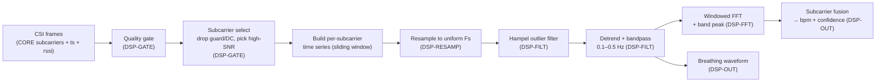

# DSP — Respiration Signal Extraction Pipeline

**Segment prefix:** `DSP-`
**Crate:** `wave-core` (same pure, no-I/O, `no_std`-friendly lib; `DSP-` is its signal layer)
**Upstream:** `docs/high-level-design.md` (Approach → DSP pipeline; Decision #5; Goal 1 = ±2 bpm)
**Consumes:** `CORE-` subcarriers + rx metadata; the 64-byte alignment guarantee; the *gapped-stream* assumption.

## Context and Design Philosophy

`DSP-` turns a stream of parsed CSI frames into a **breathing waveform and a respiration-rate estimate**, validated against dataset ground truth to ±2 bpm (HLD Goal 1). This is the segment that decides whether `wave-parse` actually *senses* anything — so correctness against real data dominates every other concern.

Principles:

1. **Correctness first, then speed.** The reference path is a clear, testable implementation; SIMD is applied to the inner loops (Hampel, filtering, FFT butterflies) *after* a scalar reference matches ground truth, never before.
2. **Zero-allocation steady state.** A `DspProcessor` owns all scratch buffers, preallocated at construction. Per-frame and per-window processing allocate nothing.
3. **Gap-tolerant.** Because `CORE-`'s ring is drop-oldest, the input is a stream that *may have gaps*. The pipeline resamples onto a uniform time grid using frame timestamps rather than assuming evenly-spaced samples.
4. **Pure.** No I/O, no logging side effects in the hot path; outputs are values returned to the host.

## Pipeline Overview

## Input Model & Quality Gating

The processor consumes frames in arrival order, each providing: a timestamp (`CORE`'s `timestamp_us`, microseconds, via `CORE-PARSE-010`, used for resampling), `rssi`/`noise_floor` (for gating, via `CORE-PARSE-009`), and the subcarrier iterator.

- **Frame gating:** frames with `rssi` below a configured floor or `noise_floor` above a ceiling are dropped from the window (and counted in a `DSP-`-side `gated_frames` counter — *separate* from `CORE`'s `dropped_frames`, per `CORE-RING-008`).
- **Subcarrier selection:** guard/null/DC carriers are removed. `CORE` supplies each carrier's *physical index* (`CORE-SUB-008`); `DSP-` owns the **classification table** of which physical indices are guard/null/DC (this is the filtering decision `CORE-SUB-007` deliberately leaves to `DSP-`). From the remainder, a fixed number `K` of subcarriers with the highest in-band variance (strongest respiration SNR) are selected for the window.

## Respiration Signal Choice

The respiration signal per selected subcarrier is its **amplitude** time series (`|CSI|`). Rationale: on a single ESP32 link (no antenna pair for conjugate cancellation), amplitude is the most robust respiration carrier and is what the pinned single-link datasets target. **Phase sanitization** (next section) is retained as a specified, SpotFi-style conditioning stage for an optional phase-based extraction path, but amplitude is the default and the path validated against ground truth first.

## Phase Sanitization (optional path)

Raw CSI phase carries linear distortion from sampling-time offset (SFO) and carrier-frequency offset (CFO). When the phase path is used, each frame's per-subcarrier phase is **unwrapped** and a **linear fit across subcarrier index is removed** (least-squares slope + intercept), the SpotFi sanitization. This yields a residual phase usable for respiration. Amplitude path skips this.

## Per-Subcarrier Conditioning

1. **Resample (`DSP-RESAMP`):** map the (possibly gapped, non-uniform) timestamped samples onto a uniform grid at nominal `Fs` (derived from median inter-frame interval, ~28 Hz for the dataset). Short gaps are linearly interpolated; a gap longer than `max_gap` invalidates the current window (no rate emitted) rather than fabricating breaths across a long dropout.
2. **Hampel (`DSP-FILT`):** sliding-window median + MAD; samples deviating more than `k·MAD` (default `k = 3`) from the local median are replaced by the median. Removes motion spikes.
3. **Detrend + bandpass (`DSP-FILT`):** remove DC/slow drift, then bandpass to the respiration band **0.1–0.5 Hz (6–30 bpm)**, matching the dataset's 12–28 bpm range with margin. The bandpassed output *is* the breathing waveform.

## Spectral Estimation & Fusion

- **Windowed FFT (`DSP-FFT`):** apply a Hann window to the conditioned series, real-FFT, and find the peak bin within the respiration band. Bin → frequency → bpm.
- **Fusion (`DSP-OUT`):** combine the `K` subcarriers' band spectra (default: sum of band power, then peak) to a single rate estimate, with a **confidence** = in-band peak power / total band power. Harmonic guard: prefer the lowest-frequency strong peak so a 2× breathing harmonic isn't mistaken for the fundamental.

## Outputs

`DspProcessor::update(frame)` ingests one frame; `DspProcessor::estimate()` returns, when the window is warm and valid, `{ bpm: f32, confidence: f32, waveform: &[f32] }`, else `None` (cold start, all-gated, long gap, or no clear peak).

## Estimator State & Edge Handling

`estimate()` returns `Some` only when the window is **warm and valid**; otherwise `None` (never a fabricated rate). The guards:

- **Cold start:** `None` until the window has filled to its configured length.
- **All gated:** if every subcarrier is gated out (low RSSI / empty room), `None`.
- **No peak:** if in-band confidence (peak / total band power) is below threshold, `None` — a noisy or person-absent window does not emit a bpm.
- **Long gap:** a gap exceeding `max_gap` invalidates and **clears** the window; `None` until it refills (no breaths interpolated across a dropout).
- **Harmonic guard:** the lowest-frequency strong in-band peak is taken as the fundamental, so a 2× respiration harmonic or a heartbeat component is not mistaken for the breathing rate.
- **Layout change:** if the per-frame subcarrier count changes (bandwidth switch), the window is reset — a fixed subcarrier layout is assumed within a session.
- **Edge handling:** the Hampel filter uses an asymmetric/truncated window at series boundaries (no out-of-range access).
- **NaN/Inf hygiene:** a non-finite sample is treated as a gap sample (replaced by resample/Hampel) and never reaches the FFT.
- **Band bounds inclusive:** rates exactly at 6 or 30 bpm are in-band.
- **Sampling rate:** `Fs` is recomputed per window from the median inter-frame interval, not hardcoded, so clock drift is absorbed.

## Validation Harness

A test path (`DSP-VAL`) feeds dataset windows with known ground-truth rates and asserts the estimate is within **±2 bpm** on the validation set (HLD Goal 1). `HOST-` (`wave-replay`) owns CSV parsing **and** the CSI↔ground-truth (belt) time-alignment, delivering `(window, expected_bpm)` pairs; `DSP-` only estimates. Per the Phase-4 cross-segment rule, a validation run with any `CORE` `dropped_frames > 0` is **invalidated**; legitimate `DSP-` `gated_frames` are **reported** in the validation summary but do not by themselves fail the run.

## Memory & SIMD

`DspProcessor` preallocates: the per-subcarrier ring of `f32` samples (window length × `K`), Hampel scratch, FFT input/scratch/output, and the window function. All buffers are contiguous `f32`, 64-byte aligned (consuming `CORE`'s alignment guarantee) so the Hampel, filter, and FFT inner loops vectorize. SIMD is added per-loop behind a scalar reference that must match bit-for-bit within tolerance.

## Decisions & Alternatives

| Decision | Chosen | Alternatives | Rationale |
|---|---|---|---|
| Respiration signal | Amplitude (default); phase path optional | Phase-only; complex CSI | Single-link ESP32 lacks antenna pairs for phase cancellation; amplitude is robust and matches the pinned datasets. Phase retained for the SpotFi demonstration. |
| Non-uniform sampling | Resample to uniform `Fs` via timestamps | Assume uniform 28 Hz | `CORE` drops frames (gaps); FFT assumes uniform sampling. Resampling makes the gapped-stream contract safe. |
| Rate estimator | Windowed FFT + band peak | Time-domain peak/zero-cross counting; autocorrelation | FFT band power is robust to noise and gives a confidence measure; matches HLD Decision #5. |
| FFT implementation | Hand-written radix-2 real-FFT in the core | `rustfft` crate | Keeps the core `no_std`/zero-alloc and is the intended DSP portfolio demonstration; `rustfft` needs alloc/std. A scalar reference is validated before SIMD. |
| Outlier filter | Hampel (median + MAD) | Mean ± σ clipping; Kalman | Robust to spikes without a motion model; cheap; standard in CSI respiration literature. |
| Multi-subcarrier | Select top-`K` by SNR, fuse band power | Single best subcarrier; all subcarriers | Fusion improves SNR and stability; top-`K` bounds cost and buffer size. |

## Open Questions & Future Decisions

### Resolved
1. ✅ Amplitude is the default respiration signal; phase sanitization is the optional path.
2. ✅ Resample to uniform `Fs` before FFT (gap tolerance).
3. ✅ Respiration band 0.1–0.5 Hz; ±2 bpm validation gate.
4. ✅ `estimate()` returns `None` rather than a fabricated rate on cold start, all-gated, low-confidence, or long-gap windows (see Estimator State & Edge Handling).
5. ✅ Lowest-frequency strong peak is the fundamental (harmonic guard); band bounds inclusive; `Fs` recomputed per window; non-finite samples treated as gaps.
6. ✅ Per-frame timestamp dependency resolved by a `CORE-` cascade (`CORE-PARSE-010`, `timestamp_us`, microseconds). `DSP-` owns the guard/DC/null classification table; `CORE-` supplies physical indices only.

### Deferred
1. ✅ **Dataset format confirmed and validation passing.** Used the open WiFi-CSI-MiningTool dataset (Intel-5300 CSI Tool, 90 amplitude columns, Fs≈25 Hz, BPM-labeled). `DSP-VAL-001` passes on subject S10 across 9/12/15/18/21 bpm (errors < 0.05 bpm) via `tests/dsp.rs::validates_within_two_bpm_on_dataset` (data fetched by `scripts/fetch_dataset.sh`). Note: this is Intel-5300, not ESP32 — the `DSP-` layer is source-agnostic; the ESP32 `HOST-` adapter remains future work.
2. **`Fs`, window length, `K`, Hampel `k`, `max_gap`, band edges** — concrete values tuned against the dataset during implementation; the LLD fixes the *shape*, not the constants.
3. **FFT length / zero-padding** for sub-bpm frequency resolution at the chosen window length.
4. **Heart-rate extraction** (the dataset also has an NUL-208 HR logger) — out of scope for v1; respiration only.

### Flagged cross-segment (pause before cascading)
- **CSV → frame reconstruction** and **dataset access** are `HOST-` concerns; `DSP-` consumes parsed frames only.
- **`gated_frames` (DSP) vs `dropped_frames` (CORE)** are distinct counters (`CORE-RING-008`); telemetry (`SEC-`) must report both.

## References

- HLD `docs/high-level-design.md` — Decision #5, Goal 1; pinned datasets.
- `docs/llds/core.md` — subcarrier output, index map, alignment, gapped-stream.
- SpotFi (phase sanitization), ComplexBeat (complex-CSI breathing), Hampel identifier — prior art in HLD References.
